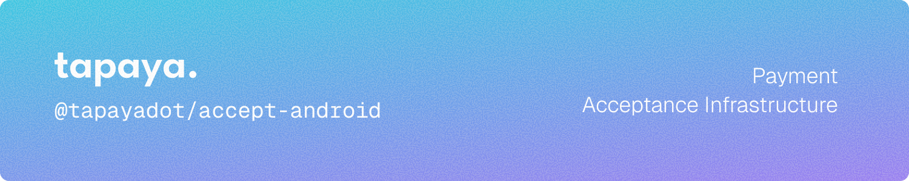

  [](https://docs.tapaya.com) [](LICENSE) 

Android SDK for integrating Tapaya Accept payment processing into your app.

## Installation

Add the Tapaya Maven repository and the dependency to your project:

```kotlin
// settings.gradle.kts
dependencyResolutionManagement {
    repositories {
        maven("https://maven.pkg.github.com/tapayadot/accept-android")
    }
}
```

```kotlin
// app/build.gradle.kts
dependencies {
    implementation("com.tapaya:accept:<version>")
}
```

## Requirements

- Min SDK 30 (Android 11)
- Target SDK 36
- Kotlin / JVM 11

## Permissions

Add the required permissions to your `AndroidManifest.xml`:

```xml
<uses-permission android:name="android.permission.INTERNET" />
<uses-permission android:name="android.permission.ACCESS_NETWORK_STATE" />
<uses-permission android:name="android.permission.CAMERA" />
<uses-permission android:name="android.permission.ACCESS_FINE_LOCATION" />
<uses-permission android:name="android.permission.ACCESS_COARSE_LOCATION" />
```

Location permission must be granted at runtime before processing payments. Use `AcceptSDK.helper` to request it.

## Usage

### Setup

```kotlin
import com.tapaya.accept.AcceptSDK
import com.tapaya.accept.AcceptEnvironment

// Initialize once at app launch (e.g. Application.onCreate)
AcceptSDK.initialize(context, AcceptEnvironment.SANDBOX)

// Authenticate with your merchant token
AcceptSDK.authenticate(
    token = "your-jwt-token",
    onSuccess = { /* ready */ },
    onError = { exception -> /* handle error */ }
)

// Or use a TokenProvider for automatic refresh (recommended for production)
AcceptSDK.authenticate(
    tokenProvider = object : TokenProvider {
        override fun getToken(): String = fetchTokenFromYourBackend()
    }
)
```

### Register Helper in your Activity

```kotlin
class MyActivity : ComponentActivity() {
    override fun onCreate(savedInstanceState: Bundle?) {
        super.onCreate(savedInstanceState)
        AcceptSDK.helper.onCreate(this)
    }

    override fun onDestroy() {
        super.onDestroy()
        AcceptSDK.helper.onDestroy()
    }
}
```

### Request Location Permission

```kotlin
AcceptSDK.helper.requestLocationPermission(
    activity = this,
    onLocationPermissionGranted = { /* proceed */ },
    onLocationPermissionDenied = { /* inform user */ }
)
```

### Card Payment (Tap-to-Pay)

```kotlin
AcceptSDK.cardTerminal.process(
    intent = CardChargeIntent(
        paymentIntentId = "pi_xxx",
        amount = 1500,
        requestedCurrency = Currency.CZK,
        settlementCurrency = Currency.EUR
    ),
    onResult = { result: CardPaymentResult ->
        when (result.status) {
            CardPaymentStatus.APPROVED -> println("Payment approved: ${result.authorizationCode}")
            CardPaymentStatus.DECLINED -> println("Payment declined: ${result.reason}")
            else -> { }
        }
    },
    onStatus = { status -> /* live status updates during processing */ },
    onError = { exception -> /* handle error */ }
)
```

### SEPA Instant Credit Transfer

```kotlin
AcceptSDK.sepaTerminal.process(
    intent = SepaInstantPaymentIntent(
        paymentIntentId = "pi_xxx",
        amount = 1000,
        requestedCurrency = Currency.EUR,
        settlementCurrency = Currency.EUR
    ),
    onResult = { result: SepaInstantPaymentResult ->
        when (result.status) {
            SepaInstantPaymentStatus.VERIFIED -> println("Transfer verified from ${result.receivedFromIban}")
            SepaInstantPaymentStatus.PENDING -> println("Transfer pending")
            else -> { }
        }
    },
    onStatus = { status -> },
    onError = { exception -> }
)
```

### Certis (Czech Instant Transfer)

```kotlin
AcceptSDK.certisTerminal.process(
    intent = CertisInstantPaymentIntent(
        paymentIntentId = "pi_xxx",
        amount = 10000,
        requestedCurrency = Currency.CZK,
        settlementCurrency = Currency.CZK
    ),
    onResult = { result: CertisInstantPaymentResult ->
        when (result.status) {
            CertisInstantPaymentStatus.VERIFIED -> println("Transfer verified")
            else -> { }
        }
    },
    onStatus = { status -> },
    onError = { exception -> }
)
```

### KYB Onboarding

```kotlin
// Check identity readiness for a payment method
AcceptSDK.identity.loadStatus(
    paymentMethod = PaymentMethod.CARD,
    onSuccess = { status: IdentityStatus ->
        when (status) {
            IdentityStatus.VERIFIED -> { /* can accept payments */ }
            IdentityStatus.MISSING_DETAILS -> { /* launch onboarding */ }
            else -> { }
        }
    },
    onFailure = { exception -> }
)

// Launch KYB UI (optionally with prefill data)
lifecycleScope.launch {
    AcceptSDK.identity.presentKyb(
        IdentityData(
            legalName = "Acme s.r.o.",
            businessEmail = "billing@acme.com",
            countryCode = "CZ",
            addressLine1 = "Václavské náměstí 1",
            city = "Praha",
            postalCode = "11000"
        )
    )
}
```

### Session Management

```kotlin
// Check current SDK status
val status: AcceptSDKStatus = AcceptSDK.status  // IDLE, INITIALIZED, LOGGED_IN

// Check for an in-progress payment
if (AcceptSDK.isPaymentPending()) { /* payment is ongoing */ }

// Query the result of a previous payment
AcceptSDK.getPaymentStatus(
    paymentIntentId = "pi_xxx",
    onResult = { result: AbstractPaymentResult -> },
    onError = { exception -> }
)

// Log out
AcceptSDK.logOut { /* completion */ }
```

## Error Handling

All errors are delivered as `AcceptSDKException` subclasses:

| Category | Examples |
|---|---|
| Initialization | `AcceptSDKUninitializedException`, `AcceptSDKLoginExpiredException` |
| Permissions | `AcceptSDKLocationPermissionException`, `AcceptSDKLocationDisabledException`, `AcceptNFCDisabledException` |
| Reader / Connection | `AcceptSDKReaderNotFoundException`, `AcceptSDKReaderBadConnectionException`, `AcceptSDKOfflineException` |
| Transaction | `AcceptSDKOperationTimeoutException`, `AcceptSDKPaymentNotFoundException`, `AcceptSDKCancellationException` |
| Onboarding | `AcceptSDKOnboardingException`, `AcceptSDKMissingKYBDetailsException` |

```kotlin
onError = { exception ->
    when (exception) {
        is AcceptSDKException.AcceptSDKLoginExpiredException -> reauthenticate()
        is AcceptSDKException.AcceptSDKLocationPermissionException -> requestPermissions()
        else -> showError(exception.message)
    }
}
```

## Environments

| Environment | Usage |
|---|---|
| `AcceptEnvironment.SANDBOX` | Development and testing |
| `AcceptEnvironment.PRODUCTION` | Live payments |

## Documentation

Full documentation is available at [docs.tapaya.com](https://docs.tapaya.com).

## License

Licensed under the [Apache License, Version 2.0](LICENSE).
