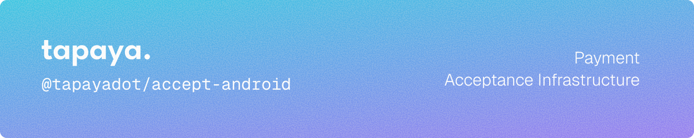

  [](https://docs.tapaya.com) [](LICENSE) 

Android SDK for integrating Tapaya Accept payment processing into your app.

## Installation

Add the dependency to your project:

```kotlin
// app/build.gradle.kts
dependencies {
    implementation("com.tapaya:accept:<version>")
}
```

Maven Central is included by default in Android projects. No additional repository configuration is needed.

## Requirements

- Min SDK 30 (Android 11)
- Target SDK 36
- Kotlin / JVM 11

## Permissions

The SDK merges the permissions it needs into your app automatically:

```xml
<uses-permission android:name="android.permission.INTERNET" />
<uses-permission android:name="android.permission.ACCESS_NETWORK_STATE" />
<uses-permission android:name="android.permission.ACCESS_FINE_LOCATION" />
<uses-permission android:name="android.permission.ACCESS_COARSE_LOCATION" />
```

Location must be granted at runtime before taking a payment. Request it with the standard
Android permission flow; if it is missing, `pay()` fails with `LocationPermissionRequired`.

## Usage

The entire SDK is reached through the `Accept` object. A typical flow is
**initialize → authenticate → take a payment**.

### Initialize

Call once, typically from `Application.onCreate`:

```kotlin
import com.tapaya.accept.Accept

class MyApplication : Application() {
    override fun onCreate() {
        super.onCreate()
        Accept.initialize(this, isProduction = false) // false = sandbox (default)
    }
}
```

### Observe state

`Accept.state` is a `StateFlow<SdkState>` that transitions through
`Idle → Initialized → Authenticated`:

```kotlin
lifecycleScope.launch {
    Accept.state.collect { state ->
        when (state) {
            SdkState.Idle -> {}          // not initialized yet
            SdkState.Initialized -> {}   // ready to authenticate
            SdkState.Authenticated -> {} // merchant + payments usable
        }
    }
}
```

### Authenticate

```kotlin
try {
    Accept.auth.authenticate("merchant_token_here")
    // state transitions to Authenticated
} catch (e: AcceptException) {
    // handle failure
}
```

### Take a payment

`pay()` returns a `Flow<PaymentEvent>`; it never throws — failures arrive as
`PaymentEvent.CreationFailed`:

```kotlin
Accept.payments.pay(
    amount = 1000,                                 // minor units (cents)
    currency = "USD",
    paymentToken = null,                           // set to resume an existing payment
    receiptConfig = PaymentReceiptConfig.Show(),    // shown after an approved payment
    nfcPosition = NfcPositionConfig.Unspecified,    // let the companion resolve antenna position
    metadata = mapOf("orderId" to "12345"),         // echoed back on every PayResult
    tip = 200,                                      // minor units; skips the plugin's own tip screen
)
    .collect { event ->
        when (event) {
            PaymentEvent.Creating -> {}                    // building the request
            is PaymentEvent.Created -> event.paymentToken  // token available before launch
            PaymentEvent.Launched -> {}                    // plugin UI shown
            is PaymentEvent.Result -> event.payResult      // terminal outcome
            is PaymentEvent.CreationFailed -> event.cause
        }
    }
```

`receiptConfig` and `nfcPosition` default to whatever was last set via
`Accept.payments.setOptions(...)`, if anything. On success, `PayResult.Success`
exposes the processor's `authCode` when the terminal reports one.

## API surface

All surfaces are accessed via the `Accept` object.

| Surface | Access | Purpose |
| --- | --- | --- |
| State | `Accept.state` | Lifecycle `StateFlow<SdkState>` |
| Auth | `Accept.auth` | `authenticate(merchantToken)` |
| SDK config | `Accept.sdk` | `version`, `isProduction`, `deviceId()`, `minimumAmounts()` |
| Merchant | `Accept.merchant` | `info()`, `config()`, `onboardingStatus()`, `availableCurrencies()` |
| Payments | `Accept.payments` | `pay(...)`, `setOptions(...)`, `status(token)`, `cancel(token)` |
| Plugin | `Accept.plugin` | `isInstalled()`, `install()`, `activateTerminal()`, `status()`, `logout()` |

Top-level helpers on `Accept`:

- `initialize(context, isProduction)` — set up and choose environment.
- `setLogLevel(level)` — set diagnostic log verbosity (`AcceptLogLevel`).
- `setLogger(logger)` — route SDK logs into a custom sink (Timber, Crashlytics, etc.).
- `setDebugLoggingEnabled(enabled)` — shorthand for `setLogLevel(DEBUG or NONE)`.
- `clear()` — wipe local state (auth token, device id, cached config); call on logout.

### Terminal activation

Physical-terminal payments require a one-time terminal activation against the external
Accept plugin app:

```kotlin
if (!Accept.plugin.isInstalled()) {
    Accept.plugin.install() // opens the store listing
}

when (val result = Accept.plugin.activateTerminal()) {
    ActivateTerminalResult.Success -> {}
    ActivateTerminalResult.Canceled -> {}
    is ActivateTerminalResult.Failed -> result.reason // ActivateTerminalFailureReason
}
```

## Error handling

Every checked failure is a subclass of the sealed `AcceptException`. Catch it broadly, or
branch on specific cases (e.g. `NotInitialized`, `NotAuthenticated`, `SessionExpired`,
`NoInternetConnection`, `LocationPermissionRequired`, `CurrencyNotAvailableForMerchant`,
`AmountBelowMinimum`). Each public function documents which exceptions it can throw via
`@throws` in its KDoc.

## Environments

| Environment | Usage |
|---|---|
| Sandbox (`isProduction = false`) | Development and testing |
| Production (`isProduction = true`) | Live payments |

## Documentation

Full documentation is available at [docs.tapaya.com](https://docs.tapaya.com).

## License

Licensed under the [Apache License, Version 2.0](LICENSE).
